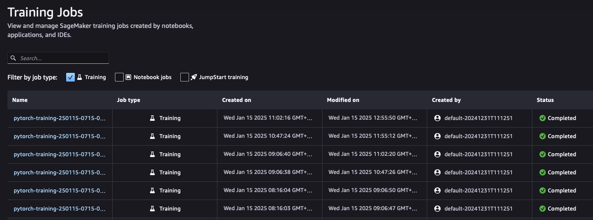
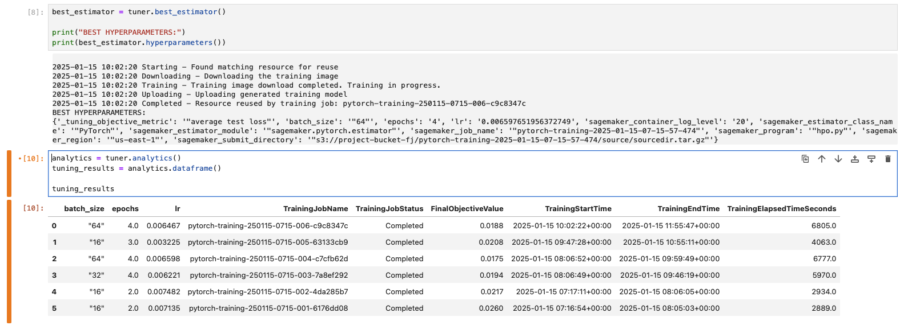
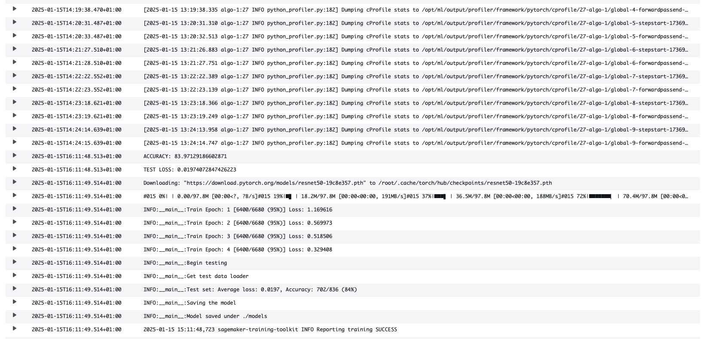
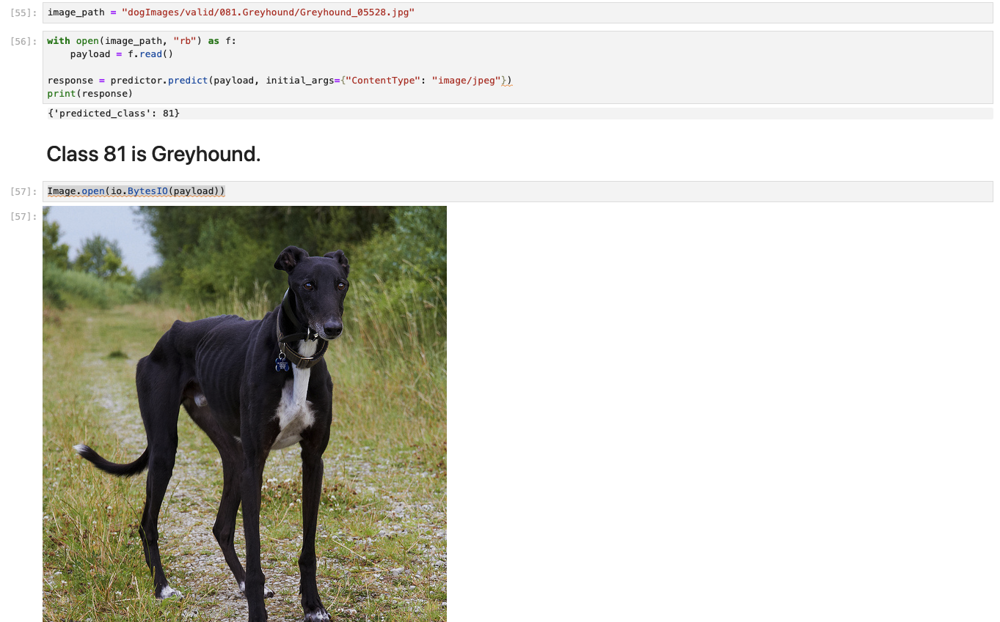
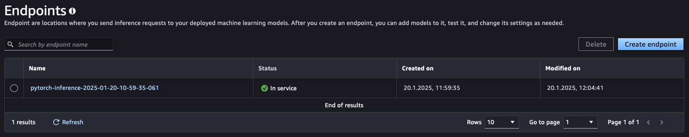

# Image Classification using AWS SageMaker

This project creates a machine learning model which is designed to classify images into one of 133 different dog breeds, using the comprehensive dog breed dataset provided by Udacity (https://s3-us-west-1.amazonaws.com/udacity-aind/dog-project/dogImages.zip). The model utilizes the pre-trained ResNet-50 architecture, a deep learning model known for its excellent performance in image recognition tasks (https://download.pytorch.org/models/resnet50-19c8e357.pth).

To adapt ResNet-50 for dog breed classification, the original classification layer of the model was replaced with a new fully connected layer specifically designed for 133 output classes. This new layer was then fine-tuned using the provided dog breed dataset. By leveraging transfer learning, the model retains the powerful feature extraction capabilities of ResNet-50 while focusing on the specific task of classifying different dog breeds. This approach combines the strengths of pre-trained deep learning models with the customization required for the unique dog breed classification challenge.

I used AWS Sagemaker to train the pretrained ResNet50-Model that can perform image classification by using the Sagemaker profiling, debugger, hyperparameter tuning.

## Project Set Up and Installation

I entered AWS through the gateway in the course and opened SageMaker Studio. There i Uploaded the starter files and made the dataset available. 

## Dataset

The dataset used for this project is a dog breed dataset provided by Udacity, which consists of images from 133 different dog breeds. The dataset is divided into three parts: training, testing, and validation sets.

Training Set: The training set contains approximately 60 images per dog breed. This large collection of images helps the model learn diverse features of each breed. Test Set: The test set consists of 6 to 8 images per breed, which are used to evaluate the model’s generalization capability after training. Validation Set: Similar to the test set, the validation set includes 6 to 8 images per breed.

The images in the dataset feature dogs in various poses and with a variety of coat colors, helping the model learn to recognize breeds from different angles and appearances. This diversity is important for ensuring the model can generalize well across real-world images of dogs, which may vary greatly in lighting, background, and posture.

### Access

I downloaded the dataset from the given Udacity link and uploaded it to my custom s3-Bucket.

## Hyperparameter Tuning

What kind of model did you choose for this experiment and why? Give an overview of the types of parameters and their ranges used for the hyperparameter search

The learning rate (lr) was selected to range from 0.001 to 0.01. They are small enough to allow stable convergence while still being large enough to make relatively fast progress. The automatic scaling ensures that the hyperparameter tuning process is more efficient and flexible.

For the batch size (batch_size), values of 16, 32, and 64 were chosen. Smaller batch sizes, like 16, result in more frequent updates to the model's weights, which can be beneficial for smaller datasets or memory-intensive models. Larger batch sizes, such as 64, tend to result in more stable gradient calculations but require more memory, which is important for larger models or datasets.

The number of epochs (epochs) was set between 2 and 4, as a smaller number of epochs is useful in early experiments to quickly evaluate the model and avoid overfitting. The number of epochs was limited to a maximum of 4 to ensure that the training does not take too long. This is particularly important when fast results are needed or when resources are limited. With just a few epochs, the model is able to learn basic patterns without overfitting, as it does not spend too much time on the training data. This allows for efficient use of computational resources and quick evaluation of model performance, while avoiding unnecessary prolonged training.

### Completed Training Jobs:




### Logs of a Training Job



## Debugging and Profiling

The rules used here monitor and analyze various aspects of the training process to identify potential issues early and optimize model performance.

The loss_not_decreasing() rule tracks whether the loss decreases consistently during training. If the loss stagnates or even increases, it might indicate issues like inappropriate hyperparameters or a faulty model architecture. The LowGPUUtilization() rule, on the other hand, checks if the GPU utilization is too low during training. Low utilization suggests that the hardware is not being efficiently used, potentially leading to suboptimal training speeds.

The ProfilerReport() rule generates a detailed profiler report, analyzing the entire training process. It captures metrics on resource usage and processing times to identify potential bottlenecks or inefficiencies. To prevent the issue of vanishing gradients, the vanishing_gradient() rule is employed. It checks if the gradients become too small during the backpropagation process, which can hinder the model’s learning.

The overfit() rule detects overfitting by monitoring the discrepancy between training and validation performance. If the model performs well on the training data but fails to generalize on the validation data, it’s a sign of overfitting. Similarly, the overtraining() rule identifies when a model is trained for too long and its performance on the validation data starts to degrade. This indicates overtraining, where the model becomes too adapted to the training data and loses its ability to generalize.

Finally, the poor_weight_initialization() rule checks the initialization of model weights. Poor initialization can significantly slow down learning or even prevent it, meaning the model may not achieve optimal performance. Together, these rules help to detect potential training issues early, allowing for targeted actions to improve model performance.

### Results

The SageMaker Debugger Profiling Report indicates that the training is mostly proceeding well, but there are some potential areas for optimization:

Batch Size: GPU utilization could be improved by increasing the batch size, as the GPUs may be underutilized.
CPU Bottleneck: High CPU usage with low GPU utilization suggests a CPU bottleneck. This could be addressed by increasing the number of data loaders or implementing pre-fetching.
Step Outlier: An outlier in step duration was detected, which may indicate a temporary bottleneck, but it doesn't appear to be a frequent issue.
Overall, optimizing batch size and data loading could improve performance, with no major issues identified.

## Model Deployment

### How to query the model:

```python
role = get_execution_role()
model_s3_path = "s3://sagemaker-us-east-1-818551132000/pytorch-training-2025-01-17-12-20-11-671/output/model.tar.gz"

jpeg_serializer = sagemaker.serializers.IdentitySerializer("image/jpeg")
json_deserializer = sagemaker.deserializers.JSONDeserializer()

class ImagePredictor(Predictor):
    def __init__(self, endpoint_name, sagemaker_session):
        super(ImagePredictor, self).__init__(
            endpoint_name,
            sagemaker_session=sagemaker_session,
            serializer=jpeg_serializer,
            deserializer=json_deserializer,
        )

pytorch_model = PyTorchModel(model_data=model_s3_path,
                             role=role,
                             entry_point='inference.py',
                             py_version='py36',
                             framework_version='1.8',
                             predictor_cls=ImagePredictor)

predictor = pytorch_model.deploy(initial_instance_count=1, instance_type='ml.g4dn.xlarge')

image_path = "dogImages/valid/081.Greyhound/Greyhound_05528.jpg"

with open(image_path, "rb") as f:
    payload = f.read()

response = predictor.predict(payload, initial_args={"ContentType": "image/jpeg"})
print(response)

Image.open(io.BytesIO(payload))
```

**inference.py:**

```python
import os
import io
import torch
import torch.nn as nn
import torchvision.models as models
from torchvision import transforms
from PIL import Image
import json


def model_fn(model_dir):
    model = models.resnet50(pretrained=True)

    for param in model.parameters():
        param.requires_grad = False

    num_features = model.fc.in_features
    model.fc = nn.Linear(num_features, 133)

    with open(os.path.join(model_dir, 'model.pth'), 'rb') as f:
        model.load_state_dict(torch.load(f, map_location=torch.device('cpu')))

    model.eval()
    return model


def input_fn(request_body, content_type):
    if content_type not in ['image/jpeg', 'image/png']:
        raise ValueError(f"Unsupported content type: {content_type}")

    image = Image.open(io.BytesIO(request_body))

    transformation = transforms.Compose([
        transforms.Resize((224, 224)),
        transforms.ToTensor(),
        transforms.Normalize([0.485, 0.456, 0.406], [0.229, 0.224, 0.225])
    ])

    return transformation(image).unsqueeze(0)


def predict_fn(input_data, model):
    with torch.no_grad():
        output = model(input_data)
        _, predicted_class = torch.max(output, 1)
    return predicted_class.item() + 1


def output_fn(prediction, accept):
    if accept == "application/json":
        return json.dumps({"predicted_class": prediction}), "application/json"
    else:
        raise ValueError(f"Unsupported accept type: {accept}")
```

### Response:



### Active Endpoint:



## Standout Suggestions
None
